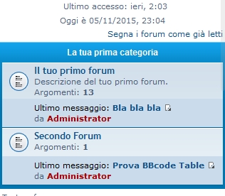

Last Post on Mobile View
============

Extensione - phpBB 3.1 Abilita la visione dell'ultimo post anche nel breakpoint a 500px. In sostanza ne permette la visione sia nel forumlist, sia nella topiclist quando il viewport è molto piccolo come ad esempio un smartphone o dispositivi con una larghezza inferiore a 500px

   
`Forumlist` | `Topiclist`  

============  

#### Requisiti
- phpBB 3.1.0 or higher
- PHP 5.3.3 or higher

## Installazione
1. [Scarica l'ultima release](https://github.com/XiradornLab/lastpostmobile) e estrai il contenuto.
2. Copia l'intero contenuto nella cartella `/ext/xiradorn/lastpostmobile/`.
3. Naviga nel PDA e recati in `Personalizzazioni -> Gestione estensioni`.
4. Trova `Top Ten Topics` in "Estensioni Disabilitate" e clicca su `Abilita`.

## Disinstallazione
1. Naviga nel PDA fino a `Personalizzazioni -> Gestione estensioni`.
2. Clicca `Disabilita` sulla estensione in questione.
3. Per una cancettazione permanete, clicca su `Cancella i dati`, quindi cancella la cartella `lastpostmobile`.

### License
[GNU General Public License v2](http://opensource.org/licenses/GPL-2.0)

© 2015 - Sir Xiradorn - Lead Developer
